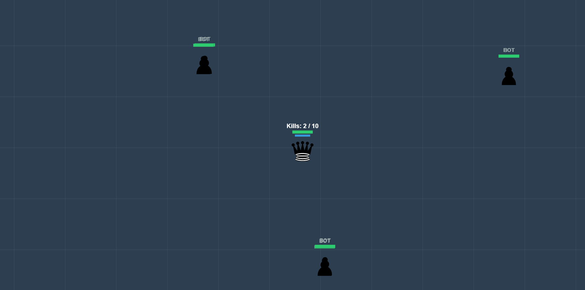

# ♟️ Chess.io

**Chess.io** is an online **battle-royale chess game** where strategy goes beyond classic rules.  
Players upgrade pieces, unlock unique abilities, and fight to become the **first King standing**.

> This project is currently in **Beta** and runs on a **local server** for testing gameplay concepts and balance.

---

## 🖼️ Game Preview



---

## 🎮 Gameplay Overview

- Multiplayer battle-royale chess
- Upgradeable chess pieces
- Every piece has **special abilities**
- Non-traditional chess mechanics
- The **first player to become King wins**

This is not classic chess — expect chaos, tactics, and unexpected power plays.

---

## 🚧 Beta Version Notice

This version of **Chess.io** is a **Beta build** intended for:

- Testing core gameplay mechanics
- Experimenting with abilities and upgrades
- Balancing combat and progression
- Gathering feedback for future development

⚠️ Currently runs on a **local server only**.

---

## 🛠️ Running Locally

```bash
# install dependencies
npm install

# start local server
npm run dev
